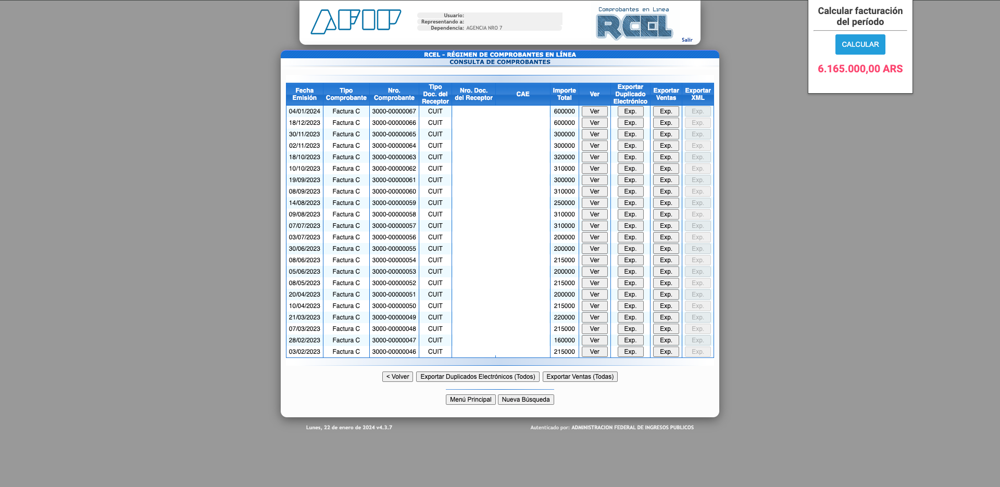

## Instalación

- Andá al navegador Chrome. 
- Escribí chrome://extensions/ en la barra de direcciones. 
- Habilitá el modo desarrollador. 
- Cargá extension descomprimida. 
- Seleccioná carpeta donde esten los archivos de la extensión.

Listo.

Ahora cuando vayas al listado de comprobantes emitidos, podes hacer clic en la extensión y nuevamente clic en el botón "Calcular".

El total del período se va a mostrar abajo.

